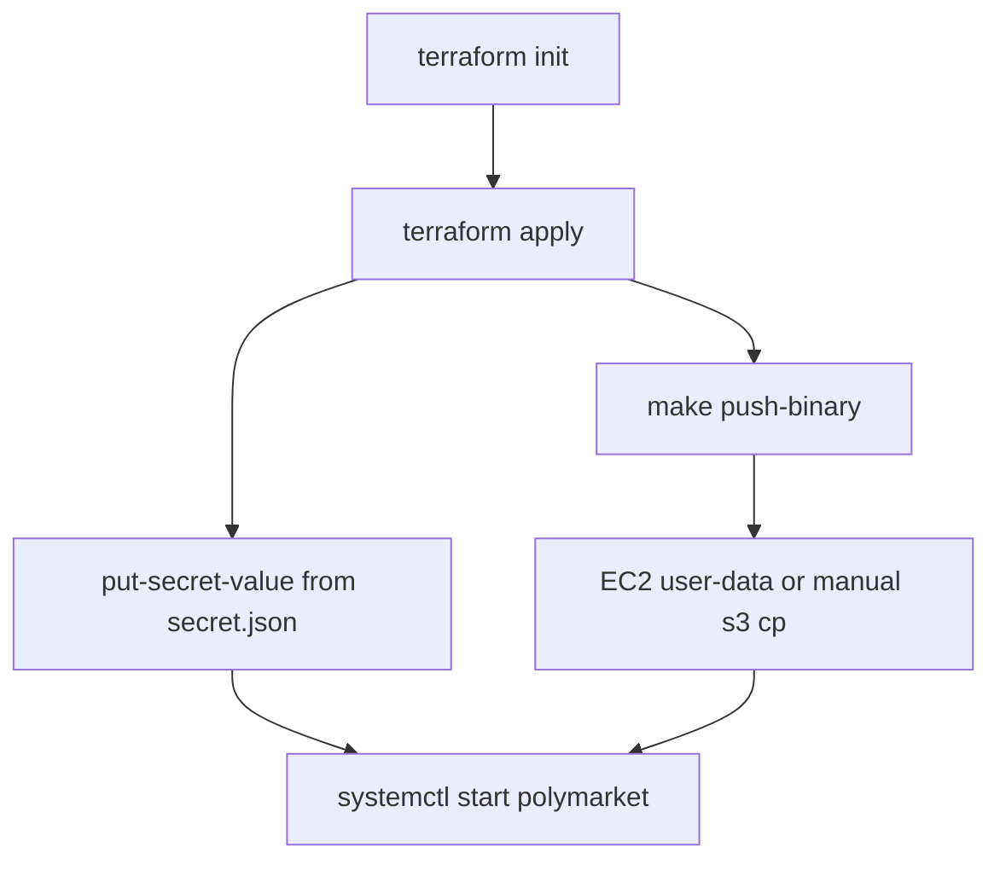

# Terraform: EC2 + S3 artifacts + Secrets Manager

This stack provisions a single **Amazon Linux 2023** EC2 instance, a private **S3 artifact bucket**, and a **Secrets Manager** secret for credential JSON. The application binary is **not** in Terraform state: you upload it with `make push-binary`, and the instance pulls it on first boot via **user-data**.

Credential JSON is also **out of band** (Console or `put-secret-value`) so secrets are not stored in `.tfstate`. See [docs/aws-secrets-manager.md](../../docs/aws-secrets-manager.md) for the JSON shape and how the Go app loads it.

## Prerequisites

| Tool | Purpose |
|------|---------|
| [Terraform](https://www.terraform.io/downloads) ≥ 1.0 | `terraform init` / `apply` in this directory |
| [AWS CLI](https://docs.aws.amazon.com/cli/latest/userguide/getting-started-install.html) v2 | Upload binary, set secret value |
| Go (repo root) | `make push-binary` builds `linux/amd64` |

**AWS credentials on your laptop** (or CI) for Terraform and `make push-binary`:

- Terraform needs permissions to create EC2, S3, IAM, Secrets Manager, and related resources in the target account/region.
- `make push-binary` needs **`s3:PutObject`** (and typically **`s3:GetObject`** to verify) on the artifact object key. Terraform does **not** create a developer IAM user; attach a policy like the snippet below to your IAM user/role or SSO permission set.

**EC2** uses an **instance profile** (no access keys on disk) for `s3:GetObject` on the artifact key and `secretsmanager:GetSecretValue` on the created secret.

Optional Terraform inputs (see `variables.tf`): `aws_region` (default `eu-west-1`), `project_name`, `artifact_key`, SSH key/CIDR, `ec2_key_name`, etc.

## Apply order (first deployment)

Follow this sequence. Steps 2 and 3 can be swapped, but the instance **user-data** runs `aws s3 cp` on first boot; if the object is missing, user-data fails until you upload the binary and replace user-data or fix the instance manually.



### 1. Initialize and apply

```bash
cd infra/terraform
terraform init
terraform apply
```

Note outputs (or use `terraform output -raw <name>`):

| Output | Use |
|--------|-----|
| `artifact_bucket` | `S3_ARTIFACT_BUCKET` for `make push-binary` |
| `artifact_key` | `S3_ARTIFACT_KEY` (default `artifacts/polymarket`) |
| `aws_region` | `AWS_REGION` for CLI and EC2 |
| `secrets_manager_secret_name` | Same value as `POLYMARKET_SECRETS_MANAGER_SECRET_ID` on the instance |
| `ec2_public_ip` / `ec2_private_ip` | SSH or debugging |
| `ec2_instance_id` | AWS Console / CLI |

By default, Terraform creates the **secret resource only** (`secret_create_placeholder_version = false`). No credential payload is written to state.

### 2. Upload the application binary

From the **repository root**, with bucket/key/region from Terraform outputs:

```bash
export AWS_REGION="$(terraform -chdir=infra/terraform output -raw aws_region)"
export S3_ARTIFACT_BUCKET="$(terraform -chdir=infra/terraform output -raw artifact_bucket)"
export S3_ARTIFACT_KEY="$(terraform -chdir=infra/terraform output -raw artifact_key)"

make push-binary
```

`push-binary` builds a static Linux binary (`CGO_ENABLED=0 GOOS=linux GOARCH=amd64`) to `dist/polymarket-linux-amd64` (override with `PUSH_BINARY_OUT=...`) and runs `aws s3 cp` to `s3://$S3_ARTIFACT_BUCKET/$S3_ARTIFACT_KEY`.

Optional: `AWS_PROFILE` is forwarded to the AWS CLI when set.

**Developer IAM** (replace `REGION`, `ACCOUNT_ID`, `BUCKET`, and `KEY` from your apply):

```json
{
  "Version": "2012-10-17",
  "Statement": [
    {
      "Sid": "UploadPolymarketArtifact",
      "Effect": "Allow",
      "Action": ["s3:PutObject", "s3:GetObject"],
      "Resource": "arn:aws:s3:::BUCKET/KEY"
    }
  ]
}
```

If you change `artifact_key` or use a different prefix, scope `Resource` to that exact key (EC2 IAM is limited to `var.artifact_key` for `GetObject`).

### 3. Set the secret value (JSON)

Create a local `secret.json` at the repo root (gitignored). Keys and examples are in [docs/aws-secrets-manager.md](../../docs/aws-secrets-manager.md#secret-json-shape).

**Do not** put real credentials in Terraform variables or commit `secret.json`.

```bash
export AWS_REGION="$(terraform -chdir=infra/terraform output -raw aws_region)"
SECRET_ID="$(terraform -chdir=infra/terraform output -raw secrets_manager_secret_name)"

aws secretsmanager put-secret-value \
  --region "$AWS_REGION" \
  --secret-id "$SECRET_ID" \
  --secret-string file://secret.json
```

On real AWS, **do not** set `AWS_ENDPOINT_URL` (that is for LocalStack only).

If the secret has no version yet, you can create the first version with the same command (or use the Console). Optional: set `secret_create_placeholder_version = true` in Terraform for a disposable placeholder; still replace with real JSON via `put-secret-value`.

### 4. Instance bootstrap and start the service

On **first boot**, EC2 **user-data** (`user-data.tpl`):

1. Ensures AWS CLI is available (Amazon Linux 2023 includes CLI v2).
2. Downloads `s3://<artifact_bucket>/<artifact_key>` to `/usr/local/bin/polymarket` and `chmod +x`.
3. Creates an empty `/etc/polymarket.env` (`chmod 600`) for **non-secret** environment variables.
4. Installs a **systemd** unit `polymarket.service`, enables it, but does **not** start it automatically in the template (enable + start after secret and binary are ready).

**Systemd environment** (set in the unit file at bootstrap):

| Setting | Source | Purpose |
|---------|--------|---------|
| `AWS_REGION` | Terraform `var.aws_region` | Secrets Manager and AWS SDK default region on EC2 |
| `POLYMARKET_SECRETS_MANAGER_SECRET_ID` | Secret **name** from Terraform | Enables credential load in the app |
| `EnvironmentFile=-/etc/polymarket.env` | Optional file on disk | Non-secrets (CLOB URL, log level, etc.) — keys not in SM JSON |

**Not** set on EC2 (by design): `AWS_ENDPOINT_URL`, `AWS_ACCESS_KEY_ID`, `AWS_SECRET_ACCESS_KEY` — the instance role supplies credentials.

Example non-secret file on the instance:

```bash
sudo tee /etc/polymarket.env <<'EOF'
POLYMARKET_CLOB_BASE_URL=https://clob.polymarket.com
LOG_LEVEL=info
EOF
sudo chmod 600 /etc/polymarket.env
```

SSH (if `ssh_allowed_cidr` and `ec2_key_name` are set), then:

```bash
sudo systemctl start polymarket
sudo systemctl status polymarket
sudo journalctl -u polymarket -f
```

User-data logs: `/var/log/user-data.log`.

If apply ran **before** `make push-binary`, user-data may have failed at `aws s3 cp`. After uploading to S3, either re-run bootstrap on the instance or replace the instance (`user_data_replace_on_change = true` triggers new user-data on `terraform apply` when user-data content changes).

Manual binary refresh on a running instance (instance role credentials):

```bash
ARTIFACT_BUCKET="<from terraform output artifact_bucket>"
ARTIFACT_KEY="<from terraform output artifact_key>"
AWS_REGION="<from terraform output aws_region>"

sudo aws s3 cp "s3://${ARTIFACT_BUCKET}/${ARTIFACT_KEY}" /usr/local/bin/polymarket --region "$AWS_REGION"
sudo chmod +x /usr/local/bin/polymarket
sudo systemctl restart polymarket
```

## Re-deploy (updates)

1. **Code change:** `make push-binary` (same env vars as above).
2. **On the instance:** `aws s3 cp` + `sudo systemctl restart polymarket` (see above), or recreate the instance if you rely on user-data only on first boot.
3. **Credential change:** `aws secretsmanager put-secret-value ...` then `sudo systemctl restart polymarket` (loader reads current secret at process start).

## Operations checklist

| Step | Command / action |
|------|------------------|
| Provision | `terraform apply` in `infra/terraform` |
| Binary in S3 | `make push-binary` with `S3_ARTIFACT_BUCKET`, `S3_ARTIFACT_KEY`, `AWS_REGION` |
| Credentials in SM | `aws secretsmanager put-secret-value --secret-string file://secret.json` |
| Non-secret config | Edit `/etc/polymarket.env` on the instance |
| Run | `sudo systemctl start polymarket` |
| Logs | `journalctl -u polymarket` |

## What Terraform creates

- **S3:** private artifact bucket (`<project_name>-artifacts-<account_id>`), public access blocked, optional versioning.
- **Secrets Manager:** secret named `<project_name>/credentials` by default (configurable).
- **IAM:** EC2 role + instance profile — `GetSecretValue` on the secret, `GetObject` on the artifact key, `ListBucket` on the artifact prefix.
- **EC2:** one instance in the default VPC, security group (egress all; optional SSH from `ssh_allowed_cidr`).

## Related docs

- [docs/aws-secrets-manager.md](../../docs/aws-secrets-manager.md) — JSON format, LocalStack, IAM for `GetSecretValue`, app behavior.
- Root [Makefile](../../Makefile) — `push-binary` target and comments.
